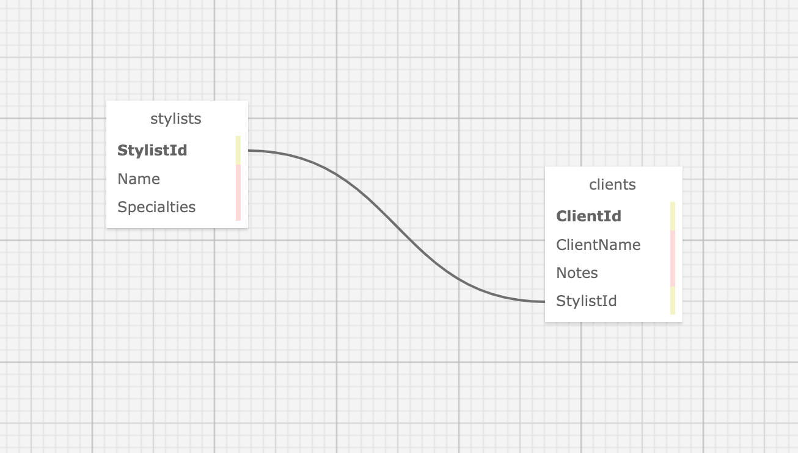

# Eau Claire's Hair Salon

## An MVC web application to manage a hair salon employees and their clients

### By Monica Barboza

## Technologies Used

* C#
* ASP.NET
* MS TEST
* Bootstrap
* MySQL
* ASP Core MVC MSBuild

## Description

This app allows the user to keep track of the employees(hairStylists) and give the user the ability to add and edit the stylist client list.

## Database Setup

* Navigate to the HairSalon directory

* Install MySqlConnector Package

    ```bash
    dotnet add package MySqlConnector -v 2.2.0

    ```


1. In the Navigator>Administration window, select Data Import/Restore

2. In Import Options select Import from Self-Contained File.

3. Under Default Schema to be Imported to, Select the "New" button
    * Enter the name of your database "monica_barboza"
    * Click OK

4. Navigate to the tab called Import Progress and click Start Import at the bottom right corner of the window.

## Setup/Installation Requirements

1. Open terminal or command prompt.
2. Clone the repository by running the following command to your desktop:

    ```bash
    git clone https://github.com/MonBoza/HairSalon.Solution.git
    ```

3. Within the production directory "HairSalon", create new file called appsettings.json
4. Within appsettings.json, put in the following code replacing the <code>uid</code> and the <code>pwd</code> values with your own username and password for MySQL.

    ```bash
    {
      "ConnectionStrings": {
        "DefaultConnection": "Server=localhost;Port=3306;database=[YOUR-DB-NAME];uid=[YOUR-USER-HERE];pwd=[YOUR-PASSWORD-HERE];"
      }
    }
    ```

5. Make sure .gitignore is added to the repository.
6. Run

    ```bash
    dotnet build
    ```

 in your terminal.
7. Open the project in your favorite code editor.

## Known Bugs

* no Known bugs

## License

Copyright 2024 MONICA BARBOZA

Permission is hereby granted, free of charge, to any person obtaining a copy of this software and associated documentation files (the “Software”), to deal in the Software without restriction, including without limitation the rights to use, copy, modify, merge, publish, distribute, sublicense, and/or sell copies of the Software, and to permit persons to whom the Software is furnished to do so, subject to the following conditions:

The above copyright notice and this permission notice shall be included in all copies or substantial portions of the Software.

THE SOFTWARE IS PROVIDED “AS IS”, WITHOUT WARRANTY OF ANY KIND, EXPRESS OR IMPLIED, INCLUDING BUT NOT LIMITED TO THE WARRANTIES OF MERCHANTABILITY, FITNESS FOR A PARTICULAR PURPOSE AND NONINFRINGEMENT. IN NO EVENT SHALL THE AUTHORS OR COPYRIGHT HOLDERS BE LIABLE FOR ANY CLAIM, DAMAGES OR OTHER LIABILITY, WHETHER IN AN ACTION OF CONTRACT, TORT OR OTHERWISE, ARISING FROM, OUT OF OR IN CONNECTION WITH THE SOFTWARE OR THE USE OR OTHER DEALINGS IN THE SOFTWARE.

Email: (mailto:<MonBoza@gmail.com>)

Copyright (c) February 02, 2024 Monica Barboza

### SQL Schema Diagram


